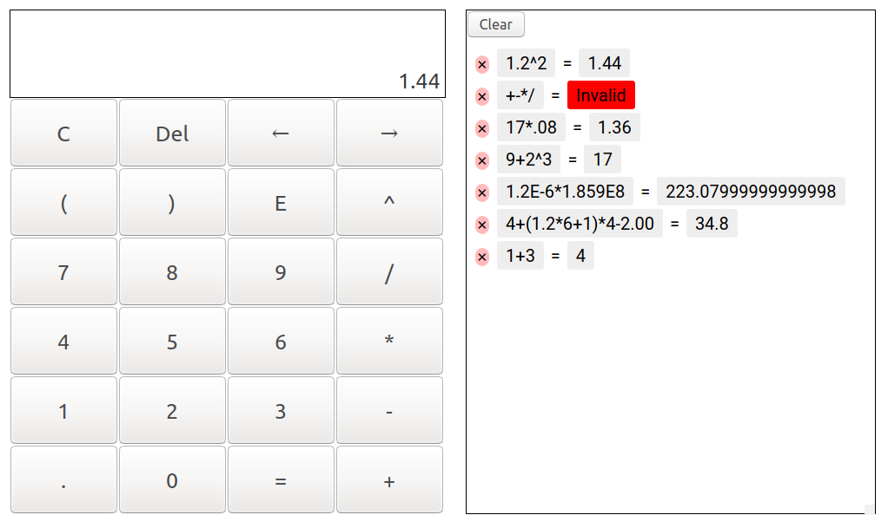

# Calculator with React.js
This is my implementation of a calculator with [React](https://reactjs.org/).
Click [here](https://hanhsienhuang.github.io/Calculator-with-Reactjs/) to see the result.

## Features

* An UI written with React.
* A parser for math expressions written in Javascript to compute the result, which are included in `src/Lexer.js` and `src/Parser.js`.

## How to run the code
* Clone this repository
* Run the following code
  
    ```
    npm install
    npm start
    ```
